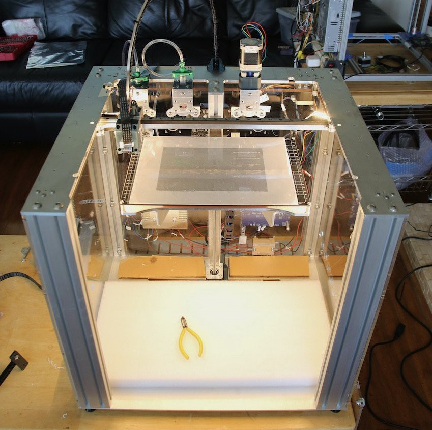
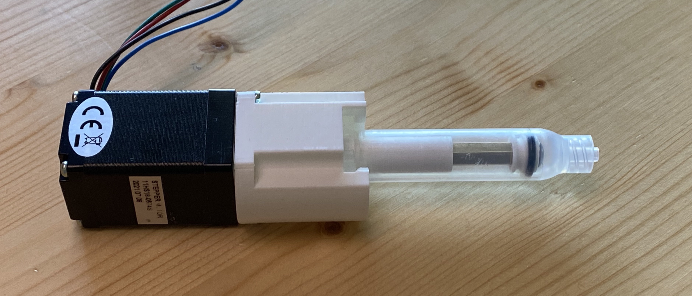

# Circuitprinter
The goal of this project is to print additive circuit traces on the E3D and Jubilee toolchanging 3D printers
 
 

## Bill of materials: 
<a href="https://docs.google.com/spreadsheets/d/1qsuu0mqhYLWQeWLX05LpEEylz75LFKVL712LdSZb1z4/edit?usp=sharing">link to BOM</a>

## Installation
[Install docs](https://github.com/npretor/circuitprinter/tree/main/src#installation)
